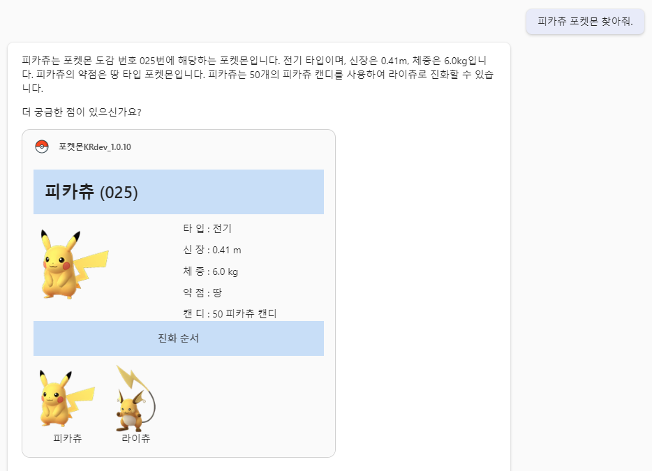

# Navigation Structure
{: .no_toc }

  

    Table of contents
  

  {: .text-delta }
- TOC
{:toc}

---

## 핸즈온 개요
이 핸즈온 실습에서는 메세지 익스텐션을 이용한 코파일럿 플러그인을 만드는 과정을 경험하게 될 것입니다.
이 핸즈온의 최종 목표는 외부시스템을 가정한 목업 API를 만들고 그 API와 연동하는 코파일럿 플러그인을 실제로 만들고 배포하는 것입니다.
본 과정을 모두 마치면 아래와 같은 플러그인을 얻게 될 것입니다.

## 핸즈온 환경
이 

## 핸즈온 준비
이

## 핸즈온 개요
이 